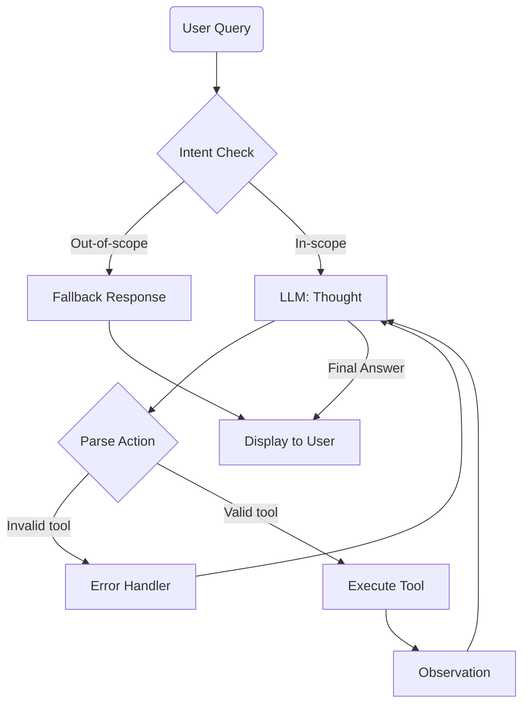

# Group Report: Lab 3 - Production-Grade Agentic System

- **Team Name**: [Name]
- **Team Members**: [Member 1, Member 2, ...]
- **Deployment Date**: [YYYY-MM-DD]

---

> [!NOTE]
> **Scoring Reference** — Group score is **45 base + up to 15 bonus = max 60 points**.
> Each section below is labeled with the rubric category it satisfies.

---

## 1. Executive Summary
<!-- Rubric: Evaluation & Analysis (partial) — 7 pts -->

*Brief overview of the agent's goal and measurable success rate compared to the baseline chatbot.*

- **Agent Goal**: [e.g., "A VNStock ReAct Agent that retrieves real-time VN stock prices and charts."]
- **Success Rate (Agent vs Chatbot Baseline)**: [e.g., "Agent: 85% correct on 20 test cases vs Chatbot: 45%"]
- **Key Outcome**: [e.g., "Our agent solved 40% more multi-step queries than the chatbot baseline by correctly chaining GetPrice → CreateChart tool calls."]

---

## 2. Chatbot Baseline
<!-- Rubric: Chatbot Baseline — 2 pts -->

*Describe the minimal chatbot baseline implementation used as the control group.*

- **Implementation**: [e.g., "A simple LLM call with a fixed system prompt — no tools, no loop. Responds directly from training knowledge."]
- **Limitations observed**: [e.g., "Hallucinated stock prices; unable to draw charts; cannot handle multi-step queries."]
- **Code reference**: [`src/chatbot.py` or relevant file]

---

## 3. System Architecture & Tooling

### 3.1 ReAct Loop — Agent v1 (Working)
<!-- Rubric: Agent v1 (Working) — 7 pts -->

*Describe the first working implementation of the Thought-Action-Observation loop (minimum 2 tools).*

```
User Query
    │
    ▼
[Guardrail / Intent Check]
    │
    ▼ (In-scope)
[LLM — Thought]
    │
    ▼
[Action Parsing]
    ├──(Invalid tool)──► Error Handler ──► Retry
    └──(Valid tool)────► Tool Execution
                              │
                              ▼
                        [Observation]
                              │
                              ▼
                        [Next Thought] ──(Final Answer)──► UI
```

- **`max_steps`**: [e.g., 5] — prevents infinite loops and billing runaway.
- **LLM Provider (Primary)**: [e.g., Gemma 4 via `langchain-google-genai`, `temperature=0`]
- **LLM Provider (Secondary/Backup)**: [e.g., GPT-4o via `src/core/openai_provider.py`]

### 3.2 Tool Definitions (Inventory)
<!-- Rubric: Tool Design Evolution — 4 pts -->

*Document the tool spec for each tool, and note any changes from v1 → v2.*

| Tool Name | Input Format | Use Case | Version Added |
| :--- | :--- | :--- | :--- |
| `ToolA` | [e.g., `string`] | [e.g., Fetch real-time stock price (VND)] | v1 |
| `ToolB` | [e.g., `string`] | [e.g., Draw Candlestick chart via Plotly] | v1 |
| `ToolC` | [e.g., `string`] | [e.g., Look up company info — uses Gemma 4 to summarize] | v2 |

**Tool Spec Evolution (v1 → v2)**:
- [e.g., "`ToolA` v1 accepted full company names → v2 restricted to 3-letter ticker codes after hallucination failures."]
- [e.g., "Added `ToolC` in v2 after identifying that company-info queries required a separate lookup step."]

### 3.3 Agent v2 — Improvements
<!-- Rubric: Agent v2 (Improved) — 7 pts -->

*Describe the specific changes made to address v1 failures.*

| Improvement | Problem in v1 | Fix in v2 |
| :--- | :--- | :--- |
| [e.g., Few-Shot examples in prompt] | [e.g., Agent hallucinated tool argument format] | [e.g., Added 3 company-name→ticker examples] |
| [e.g., Context dedup rule] | [e.g., Agent called same tool repeatedly in a loop] | [e.g., Added "Don't repeat an Action already in history" rule] |
| [e.g., Output length constraint on GetInfo] | [e.g., Gemma 4 output >500 tokens truncated context] | [e.g., Limited summary to 1 sentence / max 50 words] |

---

## 4. Telemetry & Performance Dashboard
<!-- Rubric: Extra Monitoring (Bonus) — +3 pts -->

*Industry metrics collected during the final test run. Include both Agent v1 and v2 results for comparison.*

| Metric | Agent v1 | Agent v2 |
| :--- | :--- | :--- |
| **Average Latency (P50)** | [e.g., 1,500 ms] | [e.g., 1,350 ms] |
| **Max Latency (P99)** | [e.g., 6,000 ms] | [e.g., 4,800 ms] |
| **Average Tokens per Task** | [e.g., 520 tokens] | [e.g., 420 tokens] |
| **Average ReAct Steps per Task** | [e.g., 2.8 steps] | [e.g., 1.8 steps] |
| **Total Cost of Test Suite** | [e.g., $0.06] | [e.g., $0.03] |
| **Tool Call Success Rate** | [e.g., 73.3%] | [e.g., 93.3%] |

> **Analysis**: [e.g., "Token count dropped 19% between v1 and v2 due to the output-length constraint on `GetInfo`, which directly reduced context bloat in ReAct loop iterations."]

---

## 5. Trace Quality — Successful & Failed Traces
<!-- Rubric: Trace Quality — 9 pts -->

*Document at least one successful trace and at least one failed trace with full Thought-Action-Observation logs.*

### 5.1 Successful Trace

- **Input**: [e.g., `"Giá FPT hôm nay?"`]
- **Full Trace**:
```
Thought: Người dùng hỏi giá cổ phiếu FPT. Tôi cần gọi GetPrice với mã FPT.
Action: GetPrice(FPT)
Observation: Giá hiện tại của FPT là 85,200 VND.
Thought: Đã có kết quả. Tôi sẽ trả lời người dùng.
Final Answer: Giá cổ phiếu FPT hôm nay là 85,200 VND.
```
- **Result**: ✅ Correct in 1 step.

### 5.2 Failed Trace (Before Fix)

- **Input**: [e.g., `"Vinamilk là công ty gì?"`]
- **Full Trace**:
```
Thought: ...
Action: GetInfo(Vinamilk)       ← Wrong: used company name instead of ticker
Observation: Không tìm thấy mã 'Vinamilk'.
Thought: ...
Action: GetInfo(Vinamilk)       ← Repeated same mistake
...
AGENT_END: max_steps_reached
```
- **Root Cause**: [e.g., "No Few-Shot examples mapping company names → ticker codes."]
- **Fix**: [e.g., "Added examples to system prompt; agent now correctly calls `GetInfo(VNM)`."]

---

## 6. Evaluation & Analysis — Chatbot vs Agent
<!-- Rubric: Evaluation & Analysis — 7 pts | Ablation Experiments (Bonus) — +2 pts -->

### 6.1 Data-Driven Comparison

| Test Case | Chatbot Result | Agent v1 Result | Agent v2 Result | Winner |
| :--- | :--- | :--- | :--- | :--- |
| [Simple Q: price lookup] | ❌ Hallucinated | ✅ Correct | ✅ Correct | **Agent** |
| [Multi-step: compare 2 stocks] | ❌ Hallucinated | ⚠️ Partial | ✅ Correct | **Agent v2** |
| [Chart request] | ❌ Cannot render | ✅ Correct | ✅ Correct | **Agent** |
| [Out-of-scope question] | ✅ Declined politely | ❌ Called wrong tool | ✅ Fallback | Agent v2 |

### 6.2 Ablation: Prompt v1 vs Prompt v2
<!-- Bonus: Ablation Experiments — +2 pts -->

- **Change**: [e.g., "Added 'Always verify tool argument format before calling' + 3 Few-Shot examples."]
- **Result**: [e.g., "Tool call errors dropped from 27% → 6.7% across 15 runs."]

---

## 7. Flowchart & Group Insights
<!-- Rubric: Flowchart & Insight — 5 pts -->

### 7.1 Final System Flowchart

*(Paste your Mermaid diagram or architecture image here)*



### 7.2 Group Learning Points

1. [e.g., "The `Thought` block is critical — without it, the LLM jumps to actions without checking context."]
2. [e.g., "Few-Shot examples in the system prompt had a larger impact on accuracy than model size."]
3. [e.g., "Telemetry revealed that 60% of latency came from tool execution, not LLM inference."]

---

## 8. Failure Handling & Guardrails
<!-- Bonus: Failure Handling — +3 pts -->

*Describe any retry logic, guardrails, or fallback mechanisms implemented.*

- **Max Steps Guard**: [e.g., "`max_steps = 5` — agent terminates and returns a friendly error after 5 attempts."]
- **Action Error Handler**: [e.g., "If tool name is not in the registered list, feed an error message back to the LLM for self-correction (1 retry)."]
- **API Timeout Fallback**: [e.g., "Tool calls wrap `requests` with a 10s timeout; on failure, returns a graceful error string to the Observation."]
- **Human Escalation**: [e.g., "After 3 consecutive tool failures, sends a Telegram alert to admin."]

---

## 9. Extra Tools
<!-- Bonus: Extra Tools — +2 pts -->

*Document any advanced tools implemented beyond the basic requirements.*

| Tool Name | Type | Description |
| :--- | :--- | :--- |
| [e.g., `GetInfo`] | [e.g., LLM-powered summary] | [e.g., Uses Gemma 4 to summarize company fundamentals from structured data.] |
| [e.g., `SearchWeb`] | [e.g., Browsing] | [e.g., Retrieves live news headlines for a given stock ticker using SerpAPI.] |

---

## 10. Code Quality & Telemetry Integration
<!-- Rubric: Code Quality — 4 pts -->

*Evidence of clean, modular code and telemetry instrumentation.*

- **Modularity**: [e.g., "Tools are defined independently in `src/tools/`, decoupled from the agent loop in `src/agent/agent.py`."]
- **Telemetry**: [e.g., "Every `TOOL_CALL`, `PARSE_ERROR`, and `AGENT_END` event is logged to `logs/YYYY-MM-DD.json` via `src/telemetry/logger.py`."]
- **Provider Abstraction**: [e.g., "LLM backends (Gemma 4, GPT-4o, local) are swappable via `src/core/llm_provider.py` without changing agent code."]

---

> [!NOTE]
> Submit this report by renaming it to `GROUP_REPORT_[TEAM_NAME].md` and placing it in this folder.
